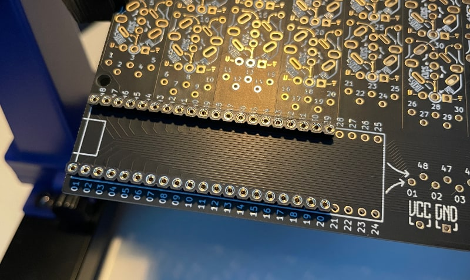
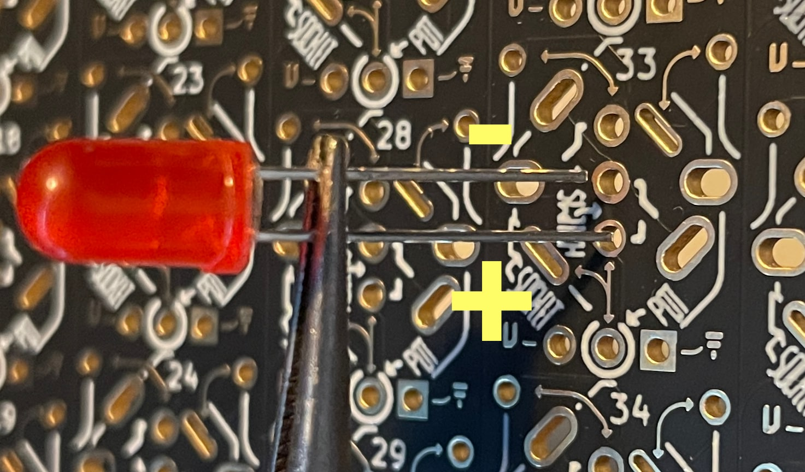
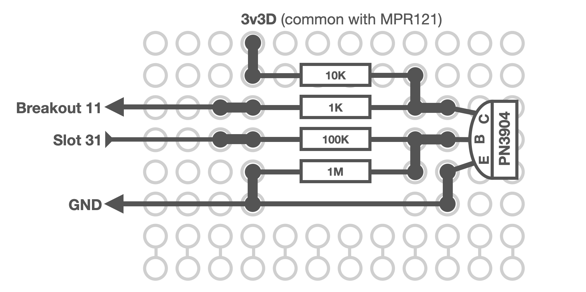

# Build Instructions (work in progress)

### Daisy Seed
- Place and solder Daisy Seed female headers as shown at the photo. Tip: You can use painter's tape to hold them in place while soldering.
  
  
- Use multimeter to check there are no short circuits between pins.
- Insert male headers into female counterparts, place Daisy on top and solder.
- Wire power and ground as following:
  | Breakout Number | Target Footprint |
  |-----------------|------------------|
  | 29 (3v3 Analog) |        VCC       |
  |    20 (AGND)    |        GND       |
  |    48 (DGND)    |        GND       |

### LEDs
Please ensure polarity of LEDs is right. An anode (longer leg) should go into signal hole while a katode (shorter leg) goes into the ground hole.


Tip: you can use painters tape to hold leds in place while soldering.
- Place and solder red LED into the slot 33 as shown at the photo. 
- Place and solder white LEDs into slots 28 and 38 as shown at the photo.
- Wire LED slots to the board breakout using 220 Ohm resistors as following:

  |  LED  | Slot Number | Breakout Number |
  |-------|-------------|-----------------|
  | white |     28      |        44       |
  |  red  |     33      |        6        |
  | white |     38      |        42       |
  
- Check the wiring with the multimeter
- Open [hardware-test.ino](hardware-test/hardware-test.ino) and uncomment the following calls in ```setup()```:
  ```
  testLED_A();
  testLED_B();
  testLED_R();
  ```
- Connect Daisy to a computer and run hardware-test.ino. All three LEDs should lit up.
- Disconnect Daisy!

### Mix fader
- Insert four pots at slots 11, 15, 66 and 70. Don't solder yet, but make them sit relatively tight by bending slightly side legs so they produce enough tension.
- Bend slightly legs of the fader outside so they fit into the footprints pictured at the photo.
- Put the fader in place and push in slightly. It has to be horisontal but doesn't have to touch the board.
- Put the front pannel on top, screw the nuts on pots.
- Insert the screws of the fader and screw them without tightening. This way you can ensure that fader is exactly where it supposed to be.
- Turn the assembly upside down and solder the fader legs.
- Cut short pieces of whire and solder jumpers from the fader legs to corresponding footprints as on the scheme.
- Remove the front pannel and pots for now.
- Check the wiring with the multimeter
- Open [hardware-test.ino](hardware-test/hardware-test.ino) and uncomment ```testFader()``` inside ```loop()``` function.
- Connect Daisy to a computer and run hardware-test.ino. Open serial monitor. You should see output like this while moving the fader. There might be slight jitter of the value. That's normal, the software will smooth it out.

### Clock input circuit
- Solder and wire clock input circuit at the perfboard as shown at the scheme below. Please double check transistor placement. Note, the transistor should not protrude over the board more than front panel header.
  
  

### MPR121 touch sensor
- Place and solder MPR121 female header at the bottom of the perfboard as shown at the photo.
- Insert male header, put front panel on top, screw couple of nuts and align front pannel footprints with the header.
- Solder male header to the front panel as shown in the photo. Every touch pad has a dot near it which can be used for checking soldering with multimeter.
- Wire MPR121 as following:
  
  | MPR121 Breakout | Daisy Breakout |
  |-----------------|----------------|
  | SDA             | 13             |
  | SCL             | 12             |
  | 3.3V            | 46             |
  | GND             | GND            |

### Pots, Switches and Sockets
- Place pots, switches and sockets on the board as shown on the photo. Don't solder yet.
- Put the front panel in place and screw 2-3 nuts on the pots to hold it in place.
- Make sure all the components are placed properly.
- Turn the assembly upside down and solder components. Soldering switches you'll need to push them from the opposite side to hold them in place.
- Remove the front panel
- Turn all the pots to the middle and check for short circuits with the multimeter.
- Wire controls slots to the breakout as following:
#### Pots
  | Function          | Slot Number | Breakout Number |
  |-------------------|-------------|-----------------|
  | Jitter Amount A   | 11          | 39              |
  | Slice Position A  | 13          | 40              |
  | Slice Length A    | 15          | 43              |
  | Retrigger A       | 22          | 38              |
  | Speed             | 32          | 36              |
  | Pattern Crossfade | 43          | 35              |
  | Pitch             | 50          | 34              |
  | Retrigger B       | 57          | 33              |
  | Jitter Amount B   | 66          | 32              |
  | Slice Position B  | 68          | 31              |
  | Slice Length B    | 70          | 30              |
- Check the wiring with potentiometer.
- Open [hardware-test.ino](hardware-test/hardware-test.ino) and uncomment one by one the following lines:
```
void setup() {
  testKnobsA();
  testKonbsB();
  testGlobalKnobs();
}
```

- Connect Daisy to the computer and run hardware-test. Open serial monitor and make sure autoscroll is enabled. You should see outup simillar to this:

   

#### Switches 
  | Function          | Slot Number | Breakout Number |
  |-------------------|-------------|-----------------|
  | Pattern Mode A    | 03          | 45              |
  | Reverse A         | 24          | 05              |
  | Split Outputs     | 37          | 10              |
  | Mutex             | 42          | 09              |
  | Cascade           | 47          | 41              |
  | Reverse B         | 59          | 08              |
  | Pattern Mode B    | 78          | 07              |

#### Sockets
  | Function          | Slot Number | Breakout Number |
  |-------------------|-------------|-----------------|
  | Clock In          | 31          | 11              |
  | Audio In          | 36          | 16              |
  | Output A          | 41          | 18              |
  | Output B          | 46          | 19              |

