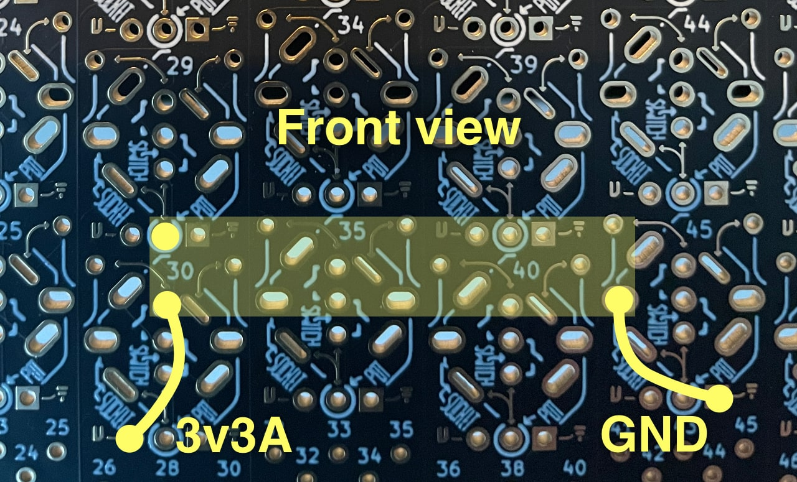
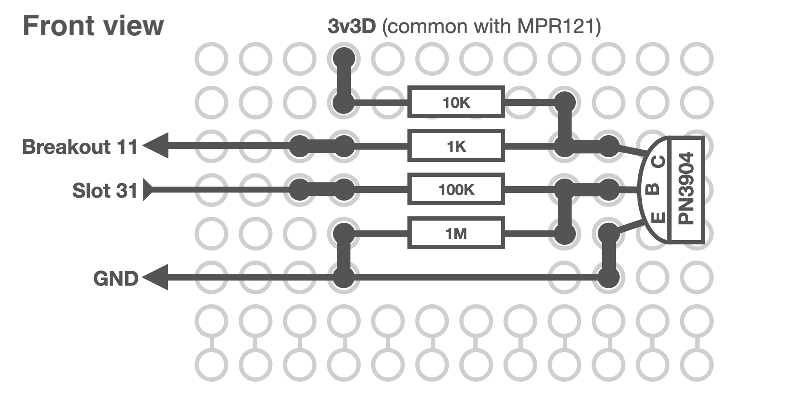

# Build Instructions

### Daisy Seed
- Place and solder Daisy Seed female headers as shown at the photo. Tip: You can use painter's tape to hold them in place while soldering.
  
  
- Use multimeter to check there are no short circuits between pins.
- Insert male headers into female counterparts, place Daisy on top and solder.
- Wire power and ground as following:
  | Daisy           | Board            |
  |-----------------|------------------|
  | 29 (3v3 Analog) |        VCC       |
  |    20 (AGND)    |        GND       |
  |    48 (DGND)    |        GND       |

### LEDs
Please ensure polarity of LEDs is right. An anode (longer leg) should go into signal hole while a katode (shorter leg) goes into the ground hole.


- Place and solder red LED into the slot 33. 
- Place and solder white LEDs into slots 28 and 38.
  


- Wire LED slots to the board breakout using 220 Ohm resistors as following:

  |  LED  | Board       | Daisy           |
  |-------|-------------|-----------------|
  | white |     28      |        44       |
  |  red  |     33      |        6        |
  | white |     38      |        42       |


- Check the wiring with the multimeter
- Open [hardware-test.ino](hardware-test/hardware-test.ino) and uncomment ```#define TEST_LEDS```
- Connect Daisy to a computer and run hardware-test.ino. All three LEDs should lit up.
- Disconnect Daisy!

### Mix fader
- Insert four pots in slots 11, 15, 66 and 70. Don't solder yet, but make them sit relatively tight by bending slightly side legs so they produce enough tension.
- Add 3 washers to the each of the pots to ensure that the front pannel is parallel to the board. This will help in the next steps of assembly so if front pannel is not put on top, make sure to screw nuts on the pots with washers so the washers are not lost.


- Bend slightly legs of the fader outside so they fit into the footprints pictured at the photo.



  
- Put the fader in place and push in slightly. It has to be horisontal but doesn't have to touch the board.


  
- Put the front pannel on top, screw nuts on pots.
- Insert screws of the fader and screw them without tightening. This way you can ensure that fader is exactly where it supposed to be.
- Turn the assembly upside down and solder the fader legs.
- Cut short pieces of whire and solder jumpers from the fader legs to nearby 3v3A and GND footprints on the back of the board as on the picture above.
- Remove the front pannel for now.
- Check the wiring with the multimeter
- Open [hardware-test.ino](hardware-test/hardware-test.ino) and uncomment ```#define TEST_FADER```.
- Connect Daisy to the computer and run hardware-test.ino. Open serial monitor. You should see below output while moving the fader. The value shuld change in range between 0 (on the left) and 1023 (on the right). There might be slight jitter of the value. That's normal, the Spotykach firmware will smooth it out.

  
  
Tip: toggle  to see live updates in the monitor. 
- Disconnect Daisy!

### Clock input circuit
- Solder and wire clock input circuit at the perfboard as shown at the scheme below. You can use resistor legs pruning as jumpers. Please double check transistor placement. Note, the transistor should not protrude over the board more than front panel header. Tip: you can use footprints 21-24 and 25-28 to "jump" to the left side of the board as shown at [this](pic/controls.jpg) photo. Notice, that footrpints 24, 25 and 26 are used to "jump" from the gate and MPR121 on the right side of the board to the footprints on the left side.
  
  
  

- Insert jack socket to the slot 31 and solder as shown below.
 
  

- Open [hardware-test.ino](hardware-test/hardware-test.ino) and uncomment ```#define TEST_TRIGGER```.
- Connect clock source (Volca sync out, eurorack clock, Keystep sync out)
- Connect Daisy to the computer and run hardware-test.ino. On-board LED of the Daisy should blink with the clock.
- Disconnect Daisy!

### MPR121 touch sensor
- Place and solder MPR121 female headers at the bottom of the perfboard (back side of the board).


  
- Insert MPR121 male headers, put MPR121 board on top and solder.


  
- Wire MPR121 as following:
  
  | MPR121          | Daisy          |
  |-----------------|----------------|
  | SDA             | 13             |
  | SCL             | 12             |
  | 3.3V            | 46             |
  | GND             | GND            |

- Open [hardware-test.ino](hardware-test/hardware-test.ino) and uncomment ```#define TEST_PADS```.
- Connect Daisy to the computer and run hardware-test.ino. Touching MPR121 pins with a finger or wire you should see the output simillar to this one. Note, only pins 1-9 are used.


- Disconnect Daisy!

### The front panel
- Insert front panel male and female header, put front panel on top, screw nuts of the pots and align front pannel footprints with the header.


  
- Solder female header to the board and the outer side of the male header to the front pannel.
- Unscrew pots nuts and carefully detach front pannel.
- Solder inner side of the header.
- Check soldering with the multimeter. Every touch pad has a dot near it which can be used for checking.

  

### Pots, Switches and Sockets
- Place pots, switches and sockets on the board as shown on the photo. Don't solder yet.
- Put washers on the pots so each has 2 of them.


  
- Put the front panel in place. Tip: it's easier to put front pannel if the switches are up. 
- Screw 2-3 nuts on the pots to hold it in place.
- Make sure all the components are placed properly.
- Turn the assembly upside down and solder components. Soldering switches you'll need to push them from the opposite side to hold them in place.
- Remove the front panel
- Turn all the pots to the middle and check for short circuits with the multimeter.
- Wire controls slots to the Daisy.

#### Sockets
  | Function          | Board       | Daisy           |
  |-------------------|-------------|-----------------|
  | Clock In          | 31          | 11              |
  | Audio In          | 36          | 16              |
  | Output A          | 41          | 18              |
  | Output B          | 46          | 19              |
  
#### Pots
  | Function          | Board       | Daisy           |
  |-------------------|-------------|-----------------|
  | Jitter Amount A   | 11          | 40              |
  | Slice Position A  | 13          | 39              |
  | Slice Length A    | 15          | 38              |
  | Retrigger A       | 22          | 37              |
  | Speed             | 32          | 36              |
  | Pattern Crossfade | 43          | 35              |
  | Pitch             | 50          | 34              |
  | Retrigger B       | 57          | 33              |
  | Jitter Amount B   | 66          | 32              |
  | Slice Position B  | 68          | 31              |
  | Slice Length B    | 70          | 30              |

#### Switches 
  | Function          | Board       | Daisy           |
  |-------------------|-------------|-----------------|
  | Pattern Mode A    | 03          | 49              |
  | Reverse A         | 24          | 05              |
  | Split Outputs     | 37          | 07              |
  | Mutex             | 42          | 08              |
  | Cascade           | 47          | 41              |
  | Reverse B         | 59          | 09              |
  | Pattern Mode B    | 78          | 10              |


- Check the wiring with potentiometer.
- Open [hardware-test.ino](hardware-test/hardware-test.ino) and uncomment one by one the following lines:
  ```
  #define TEST_KNOBS_A
  #define TEST_KNOBS_B
  #define TEST_KNOBS_C
  ```
- Connect Daisy to the computer and run hardware-test. Open serial monitor and make sure autoscroll is enabled. You should see outup simillar to this:


- Open [hardware-test.ino](hardware-test/hardware-test.ino), comment previous lines and uncomment ```#define TEST_SWITCHES```.
- Connect Daisy to the computer and run hardware-test. Open serial monitor and make sure autoscroll is enabled. You should see outup simillar to this:


### Flashing the firmware
- Download the [latest firmware release](https://github.com/bleeptools/spotykach/releases/latest). 
- Follow the [instructions](https://github.com/electro-smith/DaisyWiki/wiki#1-upload-an-example-program) on flashing the Daisy Seed with web programmer, but instead of clicking "Flash Blink", scroll to "Or select a file from your computer" section, click "Choose file" and select the bin file you've just downloaded.
- In "Programming Section" click "Program".
You should see the messages like these:
```
Erasing DFU device memory
Copying data from browser to DFU device
Wrote 110004 bytes
Manifesting new firmware
Done!
```
- Disconnect Daisy.

### Final assembly
- Put 3 washers on each pot.
- Put front pannel on top.
- Screw the nuts on pots, switches and knobs. Don't tighten too much.
- Screw the fader screws.
- Put the knobs on the pots:
  - Big knobs are for slice positions and pitch.
  - Medium knobs are for jitter amount and slice length.
  - Small knobs - all the rest.


Congratulations! You've just finished assembling you'r own Spotykach!
But, that's not the end of the story.
By changing and tweaking firmware you can add remove and modify features making it truly unique, truly yours!

  Sincerely,
  Vladyslav
